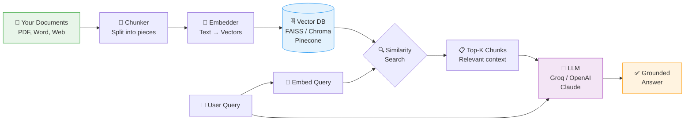
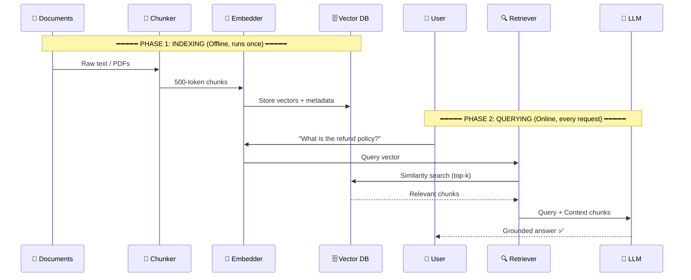
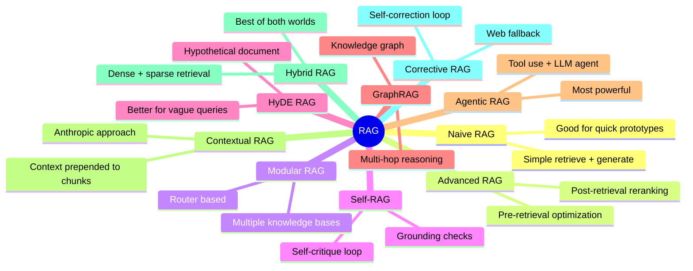
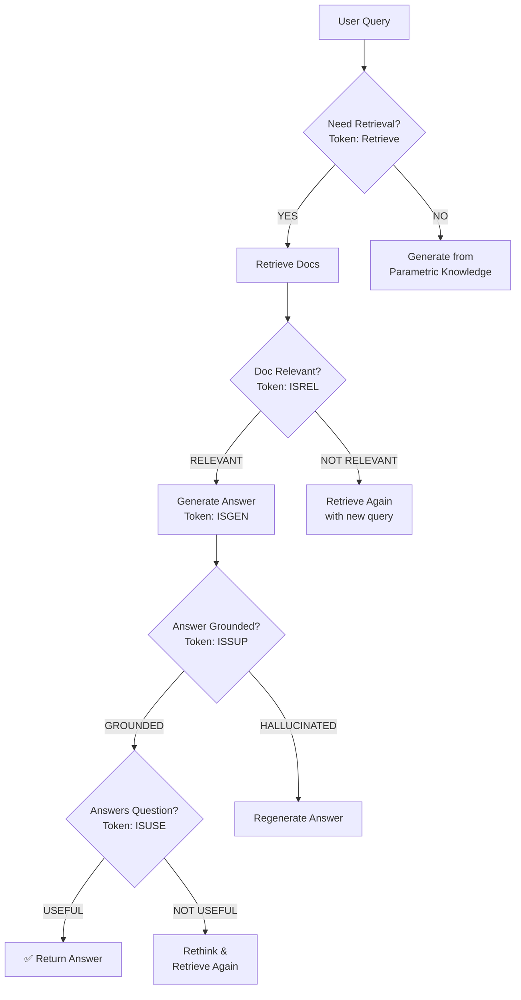
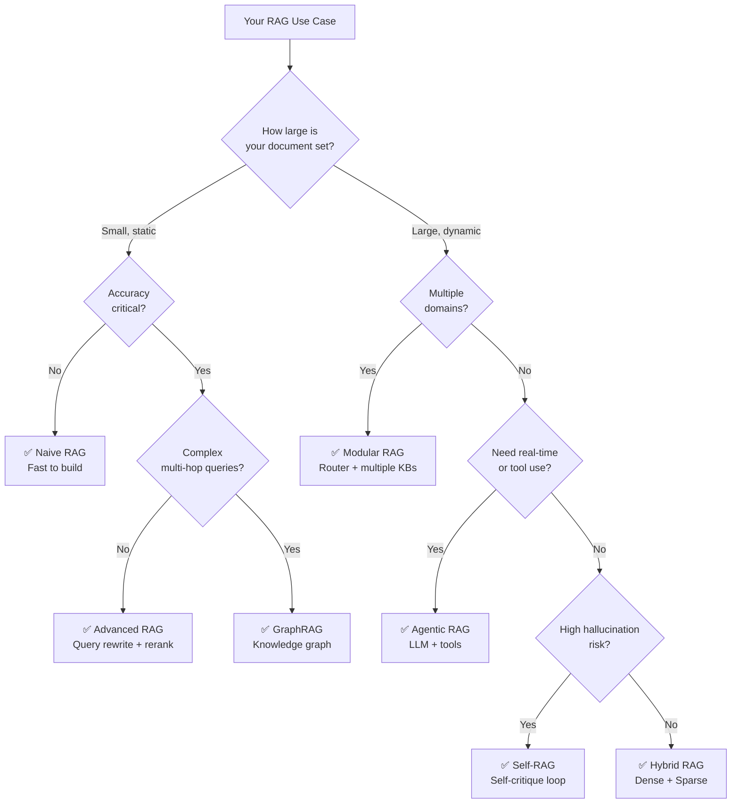

# RAG_COMPLETE_GUIDE
<div align="center">

<!-- HEADER BANNER -->


<!-- BADGES -->
[](https://github.com)
[](https://langchain.com)
[](https://python.org)
[](https://www.trychroma.com)
[](LICENSE)
[](https://github.com)

<br/>

> **🎓 KT Session:** Senior AI Engineer → Fresher  
> **📋 Format:** Step-by-step, Chat style, Code-first  
> **⏱️ Read time:** ~25 minutes  

</div>

---

## 📚 Table of Contents

| # | Topic | Jump |
|---|-------|------|
| 1 | 🤔 The Problem RAG Solves | [↗ Go](#-the-problem-rag-solves) |
| 2 | 💡 What is RAG? | [↗ Go](#-what-is-rag) |
| 3 | 🔄 The Two Phases | [↗ Go](#-the-two-phases-of-rag) |
| 4 | 🧩 Types of RAG | [↗ Go](#-types-of-rag--overview) |
| 5 | 🔹 Naive RAG | [↗ Go](#-type-1--naive-rag) |
| 6 | 🔹 Advanced RAG | [↗ Go](#-type-2--advanced-rag) |
| 7 | 🔹 Modular RAG | [↗ Go](#-type-3--modular-rag) |
| 8 | 🔹 Self-RAG | [↗ Go](#-type-4--self-rag) |
| 9 | 🔹 HyDE RAG | [↗ Go](#-type-5--hyde-rag) |
| 10 | 🔹 GraphRAG | [↗ Go](#-type-6--graphrag) |
| 11 | 🔹 Agentic RAG | [↗ Go](#-type-7--agentic-rag) |
| 12 | 🔹 Contextual RAG | [↗ Go](#-type-8--contextual-rag) |
| 13 | 🔹 Hybrid RAG | [↗ Go](#-type-9--hybrid-rag) |
| 14 | 🔹 Corrective RAG | [↗ Go](#-type-10--corrective-rag-crag) |
| 15 | 🐛 Common Issues & Fixes | [↗ Go](#-common-issues--fixes) |
| 16 | 🎯 Interview Questions | [↗ Go](#-interview-questions--answers) |
| 17 | 🗺️ Choosing the Right RAG | [↗ Go](#️-choosing-the-right-rag) |
| 18 | 📊 Evaluation with RAGAS | [↗ Go](#-evaluation-with-ragas) |
| 19 | ⚡ Quick Start | [↗ Go](#-quick-start) |

---

## 🤔 The Problem RAG Solves

<details open>
<summary><b>Click to expand — Understanding the core problem</b></summary>

<br/>

### The LLM Problem Triangle

```
        ❌ Hallucination
           /\
          /  \
         /    \
        /      \
       /________\
 ❌ Stale         ❌ No Private
 Knowledge        Knowledge
(cutoff date)    (your internal docs)
```

### Real-world Example

```
👤 You:  "What happened in our company's Q3 2024 board meeting?"
🤖 LLM:  [Confidently makes something up] ← HALLUCINATION!

👤 You:  "What's the latest LangChain version released yesterday?"  
🤖 LLM:  "I don't have information beyond my training cutoff." ← STALE!

👤 You:  "What does our internal HR Policy say about remote work?"
🤖 LLM:  "I don't have access to your internal documents." ← NO ACCESS!
```

### The RAG Solution

```
Without RAG → LLM is a student writing an exam FROM MEMORY ONLY
With RAG    → LLM is a student who can OPEN A TEXTBOOK during the exam
```

| Problem | RAG Solution |
|---------|-------------|
| Hallucination | Grounds answer in real retrieved documents |
| Stale knowledge | Update the vector DB — no model retraining needed |
| No private docs | Index your own documents into vector DB |
| No citations | Returns `source_documents` for full transparency |

</details>

---

## 💡 What is RAG?

<details open>
<summary><b>Click to expand — Core definition & architecture</b></summary>

<br/>

> **RAG = Retrieval Augmented Generation**  
> A technique where an LLM's generation is *augmented* by retrieving relevant documents at query time.

### System Architecture (Mermaid Diagram)



### Key Components Explained

| Component | What it does | Popular Options |
|-----------|-------------|-----------------|
| **Document Loader** | Reads your files | `PyPDFLoader`, `TextLoader`, `WebBaseLoader` |
| **Text Splitter** | Chunks documents into pieces | `RecursiveCharacterTextSplitter`, `TokenTextSplitter` |
| **Embedder** | Converts text → dense vectors | `HuggingFaceEmbeddings`, `OpenAIEmbeddings` |
| **Vector DB** | Stores & indexes vectors | FAISS, ChromaDB, Pinecone, Weaviate |
| **Retriever** | Finds top-K similar chunks | `as_retriever()`, BM25, MMR |
| **LLM** | Generates the final answer | GPT-4, Llama3, Gemini, Claude |

</details>

---

## 🔄 The Two Phases of RAG

<details open>
<summary><b>Click to expand — Indexing vs Query phases</b></summary>

<br/>



### Phase 1: Indexing (Offline)

```python
# ━━━━━━━━━━━━━━━━━━━━━━━━━━━━━━━━━━━━━━━━━━━━━━━━━━━
# INDEXING PHASE — Run once (or when docs change)
# ━━━━━━━━━━━━━━━━━━━━━━━━━━━━━━━━━━━━━━━━━━━━━━━━━━━

from langchain.document_loaders import PyPDFLoader, DirectoryLoader
from langchain.text_splitter import RecursiveCharacterTextSplitter
from langchain.embeddings import HuggingFaceEmbeddings
from langchain.vectorstores import Chroma

# Step 1: Load documents
loader = DirectoryLoader("./docs/", glob="**/*.pdf", loader_cls=PyPDFLoader)
raw_docs = loader.load()
print(f"✅ Loaded {len(raw_docs)} pages")

# Step 2: Split into chunks
splitter = RecursiveCharacterTextSplitter(
    chunk_size=500,       # ~500 characters per chunk
    chunk_overlap=50,     # 50-char overlap to preserve context
    separators=["\n\n", "\n", ".", " ", ""]  # split priority order
)
chunks = splitter.split_documents(raw_docs)
print(f"✅ Created {len(chunks)} chunks")

# Step 3: Add metadata to each chunk (important for citations!)
for i, chunk in enumerate(chunks):
    chunk.metadata["chunk_id"] = i
    chunk.metadata["source_file"] = chunk.metadata.get("source", "unknown")

# Step 4: Embed + Store in vector DB
embeddings = HuggingFaceEmbeddings(
    model_name="all-MiniLM-L6-v2",    # free, 384 dimensions
    model_kwargs={"device": "cpu"}     # change to "cuda" if GPU available
)
vectorstore = Chroma.from_documents(
    documents=chunks,
    embedding=embeddings,
    persist_directory="./chroma_db"   # saves to disk!
)
vectorstore.persist()
print("✅ Indexed and saved to ./chroma_db")
```

### Phase 2: Querying (Online)

```python
# ━━━━━━━━━━━━━━━━━━━━━━━━━━━━━━━━━━━━━━━━━━━━━━━━━━━
# QUERYING PHASE — Runs on every user request
# ━━━━━━━━━━━━━━━━━━━━━━━━━━━━━━━━━━━━━━━━━━━━━━━━━━━

from langchain.chains import RetrievalQA
from langchain_groq import ChatGroq  # free tier!

# Load existing vector DB (no re-indexing!)
vectorstore = Chroma(
    persist_directory="./chroma_db",
    embedding_function=embeddings
)

# Create retriever
retriever = vectorstore.as_retriever(
    search_type="similarity",     # or "mmr" for diversity
    search_kwargs={"k": 5}        # fetch top 5 chunks
)

# Setup LLM
llm = ChatGroq(
    model="llama-3.3-70b-versatile",
    temperature=0.1,               # low temp = more factual
    api_key="your-groq-api-key"
)

# Build RAG chain
chain = RetrievalQA.from_chain_type(
    llm=llm,
    chain_type="stuff",            # stuff all chunks into one prompt
    retriever=retriever,
    return_source_documents=True   # always return sources!
)

# Query!
response = chain.invoke({"query": "What is the refund policy?"})
print("Answer:", response["result"])
print("\nSources:")
for doc in response["source_documents"]:
    print(f"  → {doc.metadata['source_file']} (chunk {doc.metadata['chunk_id']})")
```

</details>

---

## 🧩 Types of RAG — Overview



---

## 🔹 Type 1 — Naive RAG

<details>
<summary><b>Click to expand — The foundation every RAG engineer starts with</b></summary>

<br/>

### What it is

The simplest pipeline: **Retrieve → Stuff into prompt → Generate**. No query rewriting, no reranking, no self-critique.

### When to use
- ✅ Prototyping and proof-of-concept
- ✅ Small, well-structured document sets
- ✅ Internal demos where speed > accuracy

### When it breaks
- ❌ Vague or ambiguous user queries
- ❌ Very large document collections (noise in results)
- ❌ Complex multi-part questions
- ❌ Chunks missing context (mid-sentence splits)

### Architecture

```
User Query
    │
    ▼
[Embed Query]
    │
    ▼
[Vector DB: Cosine Similarity Search]
    │
    ▼
[Top-K Chunks retrieved]
    │
    ▼
[Prompt = System + Query + Chunks]
    │
    ▼
[LLM generates answer]
    │
    ▼
Final Answer
```

### Full Code

```python
# ━━━━━━━━━━━━━━━━━━━━━━━━━━━━━━━━━━━━━━━━━━━━━━━━━━
# NAIVE RAG — Complete Working Example
# pip install langchain langchain-community chromadb
#             sentence-transformers langchain-groq
# ━━━━━━━━━━━━━━━━━━━━━━━━━━━━━━━━━━━━━━━━━━━━━━━━━━

from langchain.document_loaders import TextLoader
from langchain.text_splitter import RecursiveCharacterTextSplitter
from langchain.embeddings import HuggingFaceEmbeddings
from langchain.vectorstores import Chroma
from langchain.chains import RetrievalQA
from langchain_groq import ChatGroq

# ── INDEXING ───────────────────────────────────────
loader = TextLoader("company_policy.txt")
docs = loader.load()

splitter = RecursiveCharacterTextSplitter(
    chunk_size=500,
    chunk_overlap=50
)
chunks = splitter.split_documents(docs)

embeddings = HuggingFaceEmbeddings(model_name="all-MiniLM-L6-v2")
vectorstore = Chroma.from_documents(chunks, embeddings)

# ── QUERYING ───────────────────────────────────────
retriever = vectorstore.as_retriever(search_kwargs={"k": 3})

llm = ChatGroq(model="llama-3.3-70b-versatile", temperature=0)

chain = RetrievalQA.from_chain_type(
    llm=llm,
    retriever=retriever,
    return_source_documents=True
)

result = chain.invoke({"query": "What is the refund policy?"})
print("📝 Answer:", result["result"])
print("\n📚 Sources:", [d.metadata for d in result["source_documents"]])
```

</details>

---

## 🔹 Type 2 — Advanced RAG

<details>
<summary><b>Click to expand — Pre-retrieval + Post-retrieval optimizations</b></summary>

<br/>

### What it adds over Naive RAG

```
Naive RAG:    Query → Retrieve → Generate
              
Advanced RAG: Query
                │
                ▼
         [Pre-retrieval]
         • Query rewriting
         • Query expansion
         • HyDE (hypothetical doc)
                │
                ▼
           [Retrieve]
                │
                ▼
         [Post-retrieval]
         • Reranking (cross-encoder)
         • Context compression
         • Deduplication
                │
                ▼
            [Generate]
```

### When to use
- ✅ Accuracy matters more than speed
- ✅ Users ask vague/short queries
- ✅ Retrieved chunks have noise
- ✅ Production-grade applications

### Code — Pre-retrieval: Query Rewriting

```python
from langchain.prompts import PromptTemplate
from langchain.chains import LLMChain
from langchain_groq import ChatGroq

llm = ChatGroq(model="llama-3.3-70b-versatile", temperature=0)

# ── QUERY REWRITING ────────────────────────────────
rewrite_prompt = PromptTemplate(
    input_variables=["question"],
    template="""You are a search query optimizer.
    
Original question: {question}

Rewrite this into 3 different search-optimized versions 
that will help retrieve the most relevant documents.
Return ONLY the 3 queries, one per line, no numbering."""
)

rewrite_chain = LLMChain(llm=llm, prompt=rewrite_prompt)

original_query = "tell me about refunds"
rewritten = rewrite_chain.run(question=original_query)
print(rewritten)
# Output:
# What is the refund eligibility criteria and timeline?
# How do customers request and receive refunds?
# Refund policy terms conditions and exceptions

# Use ALL 3 queries for retrieval, merge + deduplicate results!
all_docs = []
for query in rewritten.strip().split("\n"):
    docs = retriever.get_relevant_documents(query)
    all_docs.extend(docs)

# Deduplicate by content
seen = set()
unique_docs = []
for doc in all_docs:
    key = doc.page_content[:100]  # use first 100 chars as key
    if key not in seen:
        seen.add(key)
        unique_docs.append(doc)
```

### Code — Query Expansion (Multi-Query Retriever)

```python
from langchain.retrievers.multi_query import MultiQueryRetriever

# Automatically generates multiple query variants!
multi_retriever = MultiQueryRetriever.from_llm(
    retriever=vectorstore.as_retriever(search_kwargs={"k": 3}),
    llm=llm
)

# One call → multiple queries generated internally → merged results
docs = multi_retriever.get_relevant_documents("refund policy")
print(f"Retrieved {len(docs)} unique docs across multiple queries")
```

### Code — Post-retrieval: Reranking

```python
from sentence_transformers import CrossEncoder

# Cross-encoder: looks at query + doc TOGETHER (much more accurate!)
reranker = CrossEncoder("cross-encoder/ms-marco-MiniLM-L-6-v2")

def rerank_documents(query: str, documents: list, top_n: int = 3) -> list:
    """
    Rerank documents using a cross-encoder.
    Cross-encoders are slower but FAR more accurate than bi-encoders.
    Use after initial retrieval as a "second pass" filter.
    """
    if not documents:
        return []
    
    # Create (query, doc) pairs for scoring
    pairs = [(query, doc.page_content) for doc in documents]
    
    # Score each pair (takes into account query-doc interaction)
    scores = reranker.predict(pairs)
    
    # Sort by score descending, return top N
    scored_docs = list(zip(scores, documents))
    scored_docs.sort(key=lambda x: x[0], reverse=True)
    
    print("\n📊 Reranking scores:")
    for score, doc in scored_docs[:top_n]:
        print(f"  Score {score:.3f}: {doc.page_content[:80]}...")
    
    return [doc for _, doc in scored_docs[:top_n]]

# Full Advanced RAG pipeline
query = "What is the refund timeline for damaged products?"
initial_docs = retriever.get_relevant_documents(query)  # fast bi-encoder
final_docs = rerank_documents(query, initial_docs, top_n=3)  # slow cross-encoder
```

### Code — Context Compression

```python
from langchain.retrievers import ContextualCompressionRetriever
from langchain.retrievers.document_compressors import LLMChainExtractor

# Extracts ONLY the relevant sentences from each chunk
# Reduces noise, saves tokens
compressor = LLMChainExtractor.from_llm(llm)

compression_retriever = ContextualCompressionRetriever(
    base_compressor=compressor,
    base_retriever=retriever
)

# Returns compressed, relevant-only content from each chunk
compressed_docs = compression_retriever.get_relevant_documents(
    "What is the refund policy?"
)
# Each doc now contains only the sentences relevant to the query!
```

</details>

---

## 🔹 Type 3 — Modular RAG

<details>
<summary><b>Click to expand — LEGO-style pluggable RAG with routing</b></summary>

<br/>

### What it is

Think of Modular RAG as a **smart router + multiple specialized RAG pipelines**. The LLM decides *which knowledge base* to query based on the user's question.

```
                    User Query
                        │
                        ▼
             ┌─── [LLM Router] ───┐
             │                    │
    "What's my leave  "How do I   "Submit expense
        balance?"      reset VPN?"  reimbursement?"
             │                │              │
             ▼                ▼              ▼
        [HR Policy       [IT Support    [Finance
          Vector DB]      Vector DB]    Vector DB]
             │                │              │
             └────────────────┼──────────────┘
                              ▼
                       [Merged Answer]
```

### When to use
- ✅ Enterprise systems with multiple document domains
- ✅ When different queries need different retrieval strategies
- ✅ Multi-tenant systems (each dept has its own KB)
- ✅ Combining retrieval + tools in one pipeline

### Code — Multi-Retrieval Router

```python
from langchain.chains.router import MultiRetrievalQAChain
from langchain.embeddings import HuggingFaceEmbeddings
from langchain.vectorstores import Chroma
from langchain_groq import ChatGroq

embeddings = HuggingFaceEmbeddings(model_name="all-MiniLM-L6-v2")
llm = ChatGroq(model="llama-3.3-70b-versatile", temperature=0)

# ── Build separate knowledge bases ─────────────────
hr_docs = [...]      # HR policy documents
it_docs = [...]      # IT support documents  
finance_docs = [...]  # Finance/accounting documents

hr_vectorstore = Chroma.from_documents(hr_docs, embeddings, 
                    collection_name="hr")
it_vectorstore = Chroma.from_documents(it_docs, embeddings, 
                    collection_name="it")
finance_vectorstore = Chroma.from_documents(finance_docs, embeddings, 
                    collection_name="finance")

# ── Define retriever info (LLM uses description to route!) ──
retriever_infos = [
    {
        "name": "HR Policy",
        "description": (
            "Answers questions about leave policy, salary structure, "
            "appraisals, employee benefits, resignation, and HR procedures"
        ),
        "retriever": hr_vectorstore.as_retriever(search_kwargs={"k": 3})
    },
    {
        "name": "IT Support",
        "description": (
            "Answers questions about laptop setup, VPN access, software "
            "installation, passwords, network issues, and IT tickets"
        ),
        "retriever": it_vectorstore.as_retriever(search_kwargs={"k": 3})
    },
    {
        "name": "Finance",
        "description": (
            "Answers questions about expense reimbursement, budget, "
            "invoices, purchase orders, and financial policies"
        ),
        "retriever": finance_vectorstore.as_retriever(search_kwargs={"k": 3})
    }
]

# ── Build the routing chain ─────────────────────────
chain = MultiRetrievalQAChain.from_retrievers(
    llm=llm,
    retriever_infos=retriever_infos,
    verbose=True  # shows which route was chosen
)

# ── Test routing ────────────────────────────────────
queries = [
    "How many casual leaves do I get per year?",    # → HR
    "How do I connect to company VPN from home?",   # → IT
    "How do I submit travel expense receipts?",     # → Finance
]

for q in queries:
    result = chain.run(q)
    print(f"\nQ: {q}")
    print(f"A: {result}")
```

### Code — Custom Modular Pipeline with LangGraph

```python
from langgraph.graph import StateGraph, END
from typing import TypedDict, List
from langchain_core.documents import Document

class RAGState(TypedDict):
    query: str
    route: str
    documents: List[Document]
    answer: str

def route_query(state: RAGState) -> RAGState:
    """LLM decides which knowledge base to use"""
    routing_prompt = f"""
    Classify this query into ONE category: HR, IT, FINANCE, or GENERAL
    
    Query: {state["query"]}
    Category (respond with just the word):"""
    
    route = llm.invoke(routing_prompt).content.strip().upper()
    return {**state, "route": route}

def retrieve(state: RAGState) -> RAGState:
    """Route to correct retriever"""
    retriever_map = {
        "HR": hr_vectorstore.as_retriever(),
        "IT": it_vectorstore.as_retriever(),
        "FINANCE": finance_vectorstore.as_retriever(),
        "GENERAL": general_vectorstore.as_retriever(),
    }
    retriever = retriever_map.get(state["route"], 
                                  retriever_map["GENERAL"])
    docs = retriever.get_relevant_documents(state["query"])
    return {**state, "documents": docs}

def generate(state: RAGState) -> RAGState:
    """Generate answer using retrieved docs"""
    context = "\n\n".join([d.page_content for d in state["documents"]])
    answer = llm.invoke(
        f"Context:\n{context}\n\nQuestion: {state['query']}\nAnswer:"
    ).content
    return {**state, "answer": answer}

# Build graph
graph = StateGraph(RAGState)
graph.add_node("router", route_query)
graph.add_node("retriever", retrieve)
graph.add_node("generator", generate)

graph.set_entry_point("router")
graph.add_edge("router", "retriever")
graph.add_edge("retriever", "generator")
graph.add_edge("generator", END)

rag_app = graph.compile()

# Run
result = rag_app.invoke({"query": "How do I apply for maternity leave?"})
print(f"Route: {result['route']}")
print(f"Answer: {result['answer']}")
```

</details>

---

## 🔹 Type 4 — Self-RAG

<details>
<summary><b>Click to expand — RAG that critiques and improves itself</b></summary>

<br/>

### What it is

Self-RAG adds a **self-reflection loop**. The LLM acts as both the *generator* and the *judge*. It asks itself:
1. "Do I even need to retrieve for this?"
2. "Is this retrieved doc actually relevant?"
3. "Is my answer grounded in the docs?"
4. "Does my answer actually answer the question?"

### The Self-RAG Loop



### When to use
- ✅ High-stakes applications (medical, legal, financial)
- ✅ When hallucination is unacceptable
- ✅ Domains where wrong answers are costly
- ✅ When you need auditable, trustworthy outputs

### Code — Self-RAG with Graders

```python
from langchain.prompts import ChatPromptTemplate
from langchain_groq import ChatGroq
from langchain_core.output_parsers import StrOutputParser

llm = ChatGroq(model="llama-3.3-70b-versatile", temperature=0)
parser = StrOutputParser()

# ── GRADER 1: Should we retrieve at all? ───────────
retrieval_grader_prompt = ChatPromptTemplate.from_template("""
You are a grader assessing whether retrieval is needed.

Question: {question}

Does answering this question REQUIRE looking up external documents?
Answer YES if it needs specific factual information from documents.
Answer NO if it can be answered from general knowledge.

Respond with ONLY: YES or NO
""")

retrieval_grader = retrieval_grader_prompt | llm | parser

# ── GRADER 2: Is the retrieved doc relevant? ───────
relevance_grader_prompt = ChatPromptTemplate.from_template("""
You are a relevance grader.

Retrieved Document: {document}
User Question: {question}

Score the document's relevance to answer the question.
Respond with ONLY: RELEVANT or NOT_RELEVANT
""")

relevance_grader = relevance_grader_prompt | llm | parser

# ── GRADER 3: Is the answer grounded? ──────────────
hallucination_grader_prompt = ChatPromptTemplate.from_template("""
You are a hallucination detector.

Facts from Documents:
{documents}

Generated Answer: {answer}

Is the answer FULLY supported by the document facts?
Any claim NOT in the documents = hallucination.

Respond with ONLY: GROUNDED or HALLUCINATED
""")

hallucination_grader = hallucination_grader_prompt | llm | parser

# ── GRADER 4: Does the answer resolve the question? ─
answer_grader_prompt = ChatPromptTemplate.from_template("""
You are an answer quality grader.

Question: {question}
Answer: {answer}

Does the answer fully address the question asked?

Respond with ONLY: USEFUL or NOT_USEFUL
""")

answer_grader = answer_grader_prompt | llm | parser

# ── SELF-RAG PIPELINE ──────────────────────────────
def self_rag_pipeline(question: str, retriever, llm, max_retries: int = 3):
    """
    Full Self-RAG pipeline with all 4 graders.
    Retries if any grader fails.
    """
    print(f"\n🔍 Question: {question}")
    
    # Check if retrieval needed
    needs_retrieval = retrieval_grader.invoke({"question": question})
    print(f"📡 Need retrieval? {needs_retrieval}")
    
    if needs_retrieval.strip() == "NO":
        answer = llm.invoke(f"Answer this: {question}").content
        return {"answer": answer, "source": "parametric_knowledge"}
    
    for attempt in range(max_retries):
        print(f"\n🔄 Attempt {attempt + 1}/{max_retries}")
        
        # Step 1: Retrieve
        docs = retriever.get_relevant_documents(question)
        
        # Step 2: Filter relevant docs
        relevant_docs = []
        for doc in docs:
            relevance = relevance_grader.invoke({
                "document": doc.page_content,
                "question": question
            })
            if "RELEVANT" in relevance:
                relevant_docs.append(doc)
                print(f"  ✅ Relevant doc found")
            else:
                print(f"  ❌ Irrelevant doc filtered out")
        
        if not relevant_docs:
            print("  ⚠️ No relevant docs found, retrying...")
            continue
        
        # Step 3: Generate answer
        context = "\n\n".join([d.page_content for d in relevant_docs])
        answer = llm.invoke(
            f"Answer using ONLY this context:\n{context}\n\nQuestion: {question}"
        ).content
        
        # Step 4: Check for hallucination
        groundedness = hallucination_grader.invoke({
            "documents": context,
            "answer": answer
        })
        print(f"  🧠 Grounded? {groundedness}")
        
        if "HALLUCINATED" in groundedness:
            print("  ⚠️ Hallucination detected, regenerating...")
            continue
        
        # Step 5: Check answer quality
        usefulness = answer_grader.invoke({
            "question": question,
            "answer": answer
        })
        print(f"  🎯 Useful? {usefulness}")
        
        if "USEFUL" in usefulness:
            return {
                "answer": answer,
                "sources": relevant_docs,
                "attempts": attempt + 1
            }
    
    return {"answer": "Unable to generate a reliable answer.", "attempts": max_retries}

# Test
result = self_rag_pipeline(
    "What is our company's maternity leave policy?",
    retriever, llm
)
print(f"\n✅ Final Answer: {result['answer']}")
```

</details>

---

## 🔹 Type 5 — HyDE RAG

<details>
<summary><b>Click to expand — Search with a hypothetical answer, not the question</b></summary>

<br/>

### The Key Insight

```
Standard RAG:
  Short question → Short embedding → Search → Finds question-like text

HyDE RAG:
  Short question → LLM generates hypothetical answer → 
  Hypothetical answer embedding → Search → Finds ANSWER-like text ✅
```

### Why it works

> Questions and answers exist in **different linguistic spaces**.  
> "What is the refund policy?" ← question-space  
> "The company provides full refunds within 30 days..." ← answer-space  
> Documents are written in answer-space. So embedding an answer finds better matches!

### When to use
- ✅ Very short or vague user queries ("tell me about leaves")
- ✅ Technical domains with jargon (medical, legal)
- ✅ When standard retrieval returns poor results
- ✅ QA over detailed technical documentation

### Code

```python
from langchain.prompts import PromptTemplate
from langchain.chains import LLMChain
from langchain.embeddings import HuggingFaceEmbeddings
from langchain.vectorstores import Chroma
from langchain_groq import ChatGroq

llm = ChatGroq(model="llama-3.3-70b-versatile", temperature=0.3)
embeddings = HuggingFaceEmbeddings(model_name="all-MiniLM-L6-v2")

# ── STEP 1: Generate a hypothetical document ───────
hyde_prompt = PromptTemplate(
    input_variables=["question"],
    template="""Write a short, detailed paragraph that would be the 
IDEAL document passage to answer the following question.
Write it as if you're writing factual documentation.
Be specific and use domain-appropriate language.

Question: {question}

Ideal document passage (2-4 sentences):"""
)

hyde_chain = LLMChain(llm=llm, prompt=hyde_prompt)

# ── STEP 2: Embed the hypothetical doc ─────────────
def hyde_retrieve(question: str, vectorstore, k: int = 5):
    """
    HyDE retrieval:
    1. Generate a hypothetical answer document
    2. Embed the hypothetical document
    3. Use that embedding to search the vector DB
    """
    print(f"📝 Original question: {question}")
    
    # Generate hypothetical answer
    hypothetical_doc = hyde_chain.run(question=question)
    print(f"\n🤔 Hypothetical document generated:")
    print(f"   {hypothetical_doc[:150]}...")
    
    # Embed the hypothetical doc (not the question!)
    hyp_embedding = embeddings.embed_query(hypothetical_doc)
    
    # Search vector DB with the hypothetical embedding
    similar_docs = vectorstore.similarity_search_by_vector(
        hyp_embedding, k=k
    )
    
    print(f"\n📚 Retrieved {len(similar_docs)} documents using HyDE")
    return similar_docs, hypothetical_doc

# ── STEP 3: Generate final answer ──────────────────
def hyde_rag_pipeline(question: str, vectorstore, llm):
    docs, hyp_doc = hyde_retrieve(question, vectorstore)
    
    context = "\n\n".join([d.page_content for d in docs])
    
    final_prompt = f"""Answer the question using ONLY the context below.
If the context doesn't contain enough information, say "I don't know."

Context:
{context}

Question: {question}
Answer:"""
    
    answer = llm.invoke(final_prompt).content
    return answer, docs

# Test
answer, sources = hyde_rag_pipeline(
    "maternity leave",    # ← very short, vague query
    vectorstore, llm
)
print(f"\n✅ Answer: {answer}")
```

### HyDE vs Standard Comparison

```python
# Comparing retrieval quality
question = "side effects"  # very short query

# Standard retrieval
standard_docs = retriever.get_relevant_documents(question)
print("Standard RAG top result:")
print(standard_docs[0].page_content[:200])

# HyDE retrieval  
hyde_docs, _ = hyde_retrieve(question, vectorstore)
print("\nHyDE RAG top result:")
print(hyde_docs[0].page_content[:200])

# HyDE typically returns much more specific, relevant results!
```

</details>

---

## 🔹 Type 6 — GraphRAG

<details>
<summary><b>Click to expand — Knowledge graphs for multi-hop reasoning</b></summary>

<br/>

### What it is

Instead of storing text chunks, GraphRAG stores **entities and relationships** in a knowledge graph. This enables questions that require connecting multiple pieces of information.

### Vector DB vs Graph DB

```
Vector DB (Naive RAG):
  "Apple is a tech company founded by Steve Jobs"
  "Tim Cook became CEO of Apple in 2011"
  → Stored as text chunks
  → Hard to answer: "Who leads the company founded by the iPhone creator?"

Graph DB (GraphRAG):
  (Steve Jobs) --[FOUNDED]--> (Apple)
  (Tim Cook)   --[CEO_OF]-->  (Apple)
  (Apple)      --[IS_A]-->    (Tech Company)
  → Structured relationships
  → Easy multi-hop: Steve Jobs founded Apple → Tim Cook is CEO of Apple ✅
```

### When to use
- ✅ Org charts, hierarchical data
- ✅ Product catalogs with complex relationships
- ✅ Medical knowledge bases (drug → treats → disease)
- ✅ Multi-hop questions ("Who manages the person who built system X?")
- ✅ Any domain where **relationships** matter more than raw text

### Code — GraphRAG with Neo4j

```python
# pip install langchain-community neo4j

from langchain.graphs import Neo4jGraph
from langchain.chains import GraphCypherQAChain
from langchain_groq import ChatGroq

# ── Connect to Neo4j ────────────────────────────────
graph = Neo4jGraph(
    url="bolt://localhost:7687",
    username="neo4j",
    password="your_password"
)

# ── Populate knowledge graph ────────────────────────
graph.query("""
    // Create nodes
    CREATE (swatz:Employee {name: 'Swatz', role: 'AI Engineer', dept: 'GenAI'})
    CREATE (ravi:Employee {name: 'Ravi', role: 'Senior Engineer', dept: 'GenAI'})
    CREATE (priya:Employee {name: 'Priya', role: 'Manager', dept: 'GenAI'})
    
    CREATE (rag_project:Project {name: 'RAG System', status: 'active', tech: 'LangChain'})
    CREATE (mlops_project:Project {name: 'MLOps Pipeline', status: 'active', tech: 'MLflow'})
    
    CREATE (genai_team:Team {name: 'GenAI Team', department: 'Engineering'})
    
    // Create relationships
    CREATE (swatz)-[:WORKS_ON]->(rag_project)
    CREATE (ravi)-[:WORKS_ON]->(rag_project)
    CREATE (ravi)-[:WORKS_ON]->(mlops_project)
    CREATE (priya)-[:MANAGES]->(swatz)
    CREATE (priya)-[:MANAGES]->(ravi)
    CREATE (swatz)-[:MEMBER_OF]->(genai_team)
    CREATE (ravi)-[:MEMBER_OF]->(genai_team)
    CREATE (priya)-[:LEADS]->(genai_team)
""")

# ── Refresh schema (LLM needs this to generate Cypher) ──
graph.refresh_schema()
print("Graph Schema:")
print(graph.schema)

# ── Build GraphCypher QA Chain ──────────────────────
llm = ChatGroq(model="llama-3.3-70b-versatile", temperature=0)

chain = GraphCypherQAChain.from_llm(
    llm=llm,
    graph=graph,
    verbose=True,          # shows generated Cypher query!
    return_intermediate_steps=True
)

# Test multi-hop queries
queries = [
    "Who works on the RAG System?",
    "Who manages the engineers working on the RAG System?",
    "What projects does Priya's team work on?",
    "Which team members work on active projects?"
]

for q in queries:
    print(f"\n❓ Query: {q}")
    result = chain.invoke({"query": q})
    print(f"🔍 Cypher: {result['intermediate_steps'][0]['query']}")
    print(f"✅ Answer: {result['result']}")
```

### Code — Hybrid GraphRAG (Graph + Vector)

```python
from langchain.retrievers import MergerRetriever

# Combine graph-based retrieval + vector retrieval
# Graph for relationship queries, vector for content queries

class GraphVectorRetriever:
    def __init__(self, graph_chain, vector_retriever):
        self.graph = graph_chain
        self.vector = vector_retriever
    
    def retrieve(self, query: str) -> dict:
        # Try graph first for relationship-type queries
        graph_keywords = ["who", "manages", "works on", "reports to", "leads"]
        use_graph = any(kw in query.lower() for kw in graph_keywords)
        
        if use_graph:
            graph_result = self.graph.invoke({"query": query})
            return {"source": "graph", "result": graph_result["result"]}
        else:
            # Fall back to vector for content queries
            docs = self.vector.get_relevant_documents(query)
            return {"source": "vector", "documents": docs}

hybrid = GraphVectorRetriever(chain, retriever)
result = hybrid.retrieve("Who manages the RAG system team?")
print(result)
```

</details>

---

## 🔹 Type 7 — Agentic RAG

<details>
<summary><b>Click to expand — The most powerful RAG — LLM + Tools + Reasoning</b></summary>

<br/>

### What it is

The LLM becomes an **autonomous agent** that can:
- Decide **when** to retrieve
- Decide **what** to retrieve
- Use **multiple tools** (not just the vector DB)
- Execute **multi-step reasoning plans**
- Take **actions** based on retrieved information

### Agentic RAG vs Standard RAG

```
Standard RAG:  Fixed pipeline → Retrieve → Answer (one shot)

Agentic RAG:   LLM plans → Uses tools → Evaluates → 
               Uses more tools → Synthesizes → Answers
               (dynamic, multi-step)
```

### When to use
- ✅ Complex questions requiring multiple lookups
- ✅ Questions needing both retrieval + computation
- ✅ Real-time data needed alongside document search
- ✅ Building AI assistants for enterprise workflows
- ✅ When you need "ReAct" style reasoning

### Code — Agentic RAG with LangChain Tools

```python
from langchain.agents import AgentExecutor, create_openai_tools_agent
from langchain.tools.retriever import create_retriever_tool
from langchain_core.tools import tool
from langchain.prompts import ChatPromptTemplate, MessagesPlaceholder
from langchain_groq import ChatGroq
from datetime import datetime

llm = ChatGroq(model="llama-3.3-70b-versatile", temperature=0)

# ── TOOL 1: HR Policy retrieval ─────────────────────
hr_tool = create_retriever_tool(
    retriever=hr_vectorstore.as_retriever(search_kwargs={"k": 3}),
    name="search_hr_policy",
    description=(
        "Search the company HR policy database. "
        "Use for questions about leaves, salary, appraisals, "
        "employee benefits, and HR procedures."
    )
)

# ── TOOL 2: Real-time leave balance ─────────────────
@tool
def get_leave_balance(employee_id: str) -> str:
    """
    Fetch current leave balance from the HR system.
    Use when employee asks about their remaining leaves.
    
    Args:
        employee_id: The employee's ID number (e.g., "EMP001")
    
    Returns:
        String with detailed leave balance breakdown
    """
    # In production: call your actual HR API here
    # For demo, returning mock data
    return f"""
    Leave Balance for Employee {employee_id} (as of {datetime.now().date()}):
    - Casual Leave: 8 remaining (of 12)
    - Sick Leave: 10 remaining (of 10)  
    - Earned Leave: 15 remaining (of 15)
    - Total Available: 33 days
    """

# ── TOOL 3: Salary calculator ───────────────────────
@tool
def calculate_prorated_salary(base_monthly_salary: float, days_worked: int) -> str:
    """
    Calculate prorated salary for partial month.
    Use when employee asks about salary for a partial month.
    
    Args:
        base_monthly_salary: Employee's monthly CTC
        days_worked: Number of working days in the month
    
    Returns:
        Calculated salary with breakdown
    """
    working_days_per_month = 22  # standard
    daily_rate = base_monthly_salary / working_days_per_month
    prorated = round(daily_rate * days_worked, 2)
    
    return f"""
    Salary Calculation:
    - Monthly Base: ₹{base_monthly_salary:,.2f}
    - Daily Rate: ₹{daily_rate:,.2f}
    - Days Worked: {days_worked} of {working_days_per_month}
    - Prorated Salary: ₹{prorated:,.2f}
    """

# ── TOOL 4: Holiday calendar lookup ─────────────────
@tool
def get_upcoming_holidays(month: str, year: int = 2024) -> str:
    """
    Get list of public holidays for a given month.
    Use when employee asks about holidays in a specific month.
    
    Args:
        month: Month name (e.g., "January", "December")
        year: Year (defaults to 2024)
    """
    # Mock holiday data
    holidays = {
        "January": ["Jan 26 - Republic Day"],
        "August": ["Aug 15 - Independence Day"],
        "October": ["Oct 2 - Gandhi Jayanti", "Oct 12 - Dussehra"],
        "November": ["Nov 1 - Diwali", "Nov 2 - Diwali Holiday"],
    }
    result = holidays.get(month, ["No major holidays this month"])
    return f"Holidays in {month} {year}:\n" + "\n".join(result)

# ── ASSEMBLE TOOLS ───────────────────────────────────
tools = [hr_tool, get_leave_balance, calculate_prorated_salary, get_upcoming_holidays]

# ── AGENT PROMPT ─────────────────────────────────────
agent_prompt = ChatPromptTemplate.from_messages([
    ("system", """You are a helpful HR assistant for our company.
    
You have access to these tools:
- search_hr_policy: Search HR policy documents
- get_leave_balance: Check employee's leave balance  
- calculate_prorated_salary: Calculate salary for partial months
- get_upcoming_holidays: Get holiday calendar

IMPORTANT RULES:
- Always use tools to get accurate, up-to-date information
- Never make up numbers — use the calculation tool
- If asked about policies, always retrieve from the HR policy tool
- Be concise but complete in your final answer
- Always tell the employee what tools you used"""),
    
    MessagesPlaceholder(variable_name="chat_history"),
    ("human", "{input}"),
    MessagesPlaceholder(variable_name="agent_scratchpad"),
])

# ── CREATE AGENT ─────────────────────────────────────
agent = create_openai_tools_agent(llm, tools, agent_prompt)
agent_executor = AgentExecutor(
    agent=agent,
    tools=tools,
    verbose=True,      # shows the ReAct thinking steps!
    max_iterations=5,  # prevent infinite loops
    return_intermediate_steps=True
)

# ── TEST COMPLEX QUERIES ──────────────────────────────
complex_queries = [
    # Needs HR policy + leave balance tool
    "I'm employee EMP042. How many more sick leaves can I take this year?",
    
    # Needs calculation + policy tool  
    "I worked 15 days this month with base salary ₹80,000. What's my salary?",
    
    # Needs multiple tools
    "I'm EMP007 planning leave in November. What holidays are there and what's my leave balance?",
]

for query in complex_queries:
    print(f"\n{'='*60}")
    print(f"❓ Query: {query}")
    result = agent_executor.invoke({
        "input": query,
        "chat_history": []
    })
    print(f"✅ Answer: {result['output']}")
```

</details>

---

## 🔹 Type 8 — Contextual RAG

<details>
<summary><b>Click to expand — Anthropic's approach to chunk context loss</b></summary>

<br/>

### The Problem it Solves

```
PROBLEM: Chunk without context

Original Document:
  "...Section 3: Leave Policy
   3.1 Casual Leave
   All employees are entitled to 12 casual leaves per year.
   These can be availed in minimum half-day units...
   
   3.2 Sick Leave
   Employees get 10 sick leaves annually.
   These require a medical certificate after 3 consecutive days..."

After chunking, one chunk might be:
  "These require a medical certificate after 3 consecutive days."

❌ Problem: Which policy? Which type of leave? 
   The chunk has LOST all context!

SOLUTION: Prepend context to each chunk BEFORE indexing
  "This chunk is from Section 3.2 (Sick Leave Policy) of the 
   HR Policy document, discussing sick leave requirements."
  + 
  "These require a medical certificate after 3 consecutive days."
```

### When to use
- ✅ Large, structured documents (policy books, manuals)
- ✅ When standard RAG gives "wrong but relevant" chunks
- ✅ Legal and compliance documents
- ✅ Technical documentation with many cross-references

### Code

```python
from langchain.prompts import PromptTemplate
from langchain.chains import LLMChain
from langchain.embeddings import HuggingFaceEmbeddings
from langchain.vectorstores import Chroma
from langchain_groq import ChatGroq
from langchain.text_splitter import RecursiveCharacterTextSplitter
import time

llm = ChatGroq(model="llama-3.3-70b-versatile", temperature=0)

# ── Context generation prompt ────────────────────────
context_prompt = PromptTemplate(
    input_variables=["full_document", "chunk"],
    template="""<document>
{full_document}
</document>

Here is a specific chunk from this document:
<chunk>
{chunk}
</chunk>

Give a SHORT context (2-3 sentences) that explains:
1. Where this chunk appears in the document structure
2. What section/topic it belongs to
3. Any important preceding context needed to understand this chunk

This context will be PREPENDED to the chunk for better retrieval.
Respond with ONLY the context sentences, no preamble or labels."""
)

context_chain = LLMChain(llm=llm, prompt=context_prompt)

def create_contextual_chunks(documents: list, max_doc_tokens: int = 8000):
    """
    Add situational context to each chunk before indexing.
    This is Anthropic's Contextual Retrieval approach.
    
    Cost: 1 LLM call per chunk (can be expensive for large docs)
    Benefit: Significantly better retrieval accuracy
    """
    splitter = RecursiveCharacterTextSplitter(
        chunk_size=500,
        chunk_overlap=50
    )
    
    contextual_chunks = []
    
    for doc in documents:
        # Get all chunks for this document
        chunks = splitter.split_documents([doc])
        full_text = doc.page_content
        
        # Truncate full doc if too long for LLM context
        if len(full_text) > max_doc_tokens * 4:  # rough char estimate
            full_text = full_text[:max_doc_tokens * 4] + "\n[Document truncated...]"
        
        print(f"📄 Processing: {doc.metadata.get('source', 'unknown')}")
        print(f"   Chunks to contextualize: {len(chunks)}")
        
        for i, chunk in enumerate(chunks):
            try:
                # Generate context for this chunk
                context = context_chain.run(
                    full_document=full_text,
                    chunk=chunk.page_content
                )
                
                # Prepend context to the chunk
                original_content = chunk.page_content
                chunk.page_content = f"{context.strip()}\n\n{original_content}"
                
                # Add metadata
                chunk.metadata["has_context"] = True
                chunk.metadata["original_content"] = original_content
                chunk.metadata["context"] = context.strip()
                
                contextual_chunks.append(chunk)
                print(f"   ✅ Chunk {i+1}/{len(chunks)} contextualized")
                
                # Rate limiting for API calls
                time.sleep(0.5)
                
            except Exception as e:
                print(f"   ⚠️ Failed to contextualize chunk {i}: {e}")
                # Fall back to original chunk
                contextual_chunks.append(chunk)
    
    return contextual_chunks

# ── Full Contextual RAG Pipeline ─────────────────────
from langchain.document_loaders import PyPDFLoader

# Load document
loader = PyPDFLoader("HR_Policy_2024.pdf")
raw_docs = loader.load()

# Create contextual chunks
print("🔄 Creating contextual chunks (this takes a while)...")
contextual_chunks = create_contextual_chunks(raw_docs)

# Index into vector DB
embeddings = HuggingFaceEmbeddings(model_name="all-MiniLM-L6-v2")
contextual_vectorstore = Chroma.from_documents(
    contextual_chunks,
    embeddings,
    collection_name="contextual_rag"
)

print(f"\n✅ Indexed {len(contextual_chunks)} contextual chunks")

# Verify the improvement
retriever = contextual_vectorstore.as_retriever(search_kwargs={"k": 3})
docs = retriever.get_relevant_documents("medical certificate requirement")

print("\n📋 Sample retrieved chunk (with context):")
print(docs[0].page_content[:400])
print("\n📋 Original chunk (without context):")
print(docs[0].metadata.get("original_content", "N/A")[:200])
```

</details>

---

## 🔹 Type 9 — Hybrid RAG

<details>
<summary><b>Click to expand — Combining dense (vector) + sparse (keyword) retrieval</b></summary>

<br/>

### Dense vs Sparse vs Hybrid

| | Sparse (BM25) | Dense (Embeddings) | Hybrid |
|---|---|---|---|
| **Method** | Keyword matching | Semantic similarity | Both combined |
| **Speed** | ⚡ Very fast | 🐢 Slower | 🔄 Medium |
| **Semantic understanding** | ❌ None | ✅ Yes | ✅ Yes |
| **Exact keyword match** | ✅ Perfect | ❌ May miss | ✅ Yes |
| **Out-of-vocab words** | ❌ Misses | ✅ Handles | ✅ Handles |
| **Best for** | Legal/medical exact terms | General QA | Production systems |

### When to use
- ✅ Production systems (standard best practice)
- ✅ Domains with specific technical terms (medical, legal)
- ✅ When queries mix exact terms + semantic meaning
- ✅ Best general-purpose retrieval strategy

### Code

```python
# pip install rank-bm25 langchain-community

from langchain.retrievers import BM25Retriever, EnsembleRetriever
from langchain.embeddings import HuggingFaceEmbeddings
from langchain.vectorstores import Chroma

# Assume chunks already created
chunks = [...]  # your document chunks

# ── SPARSE: BM25 Retriever ───────────────────────────
bm25_retriever = BM25Retriever.from_documents(chunks)
bm25_retriever.k = 5  # return top 5

# ── DENSE: Vector Retriever ──────────────────────────
embeddings = HuggingFaceEmbeddings(model_name="all-MiniLM-L6-v2")
vectorstore = Chroma.from_documents(chunks, embeddings)
vector_retriever = vectorstore.as_retriever(search_kwargs={"k": 5})

# ── HYBRID: Ensemble = BM25 + Vector ─────────────────
ensemble_retriever = EnsembleRetriever(
    retrievers=[bm25_retriever, vector_retriever],
    weights=[0.4, 0.6]   # 40% BM25, 60% dense (tune this!)
    # Higher dense weight = better for semantic queries
    # Higher BM25 weight = better for exact keyword queries
)

# Single call returns results from BOTH retrievers, 
# merged using Reciprocal Rank Fusion (RRF)
hybrid_docs = ensemble_retriever.get_relevant_documents(
    "What is Article 12 Section 3a of the leave policy?"
    # ↑ Has exact term "Article 12 Section 3a" (BM25 excels)
    # + semantic "leave policy" (Dense excels)
)

print(f"Hybrid retrieved: {len(hybrid_docs)} docs")
```

### Tuning Hybrid Weights

```python
# For different use cases, tune the weights:

# Legal / Compliance documents (exact terms matter most)
legal_retriever = EnsembleRetriever(
    retrievers=[bm25_retriever, vector_retriever],
    weights=[0.7, 0.3]   # Lean heavily on BM25 keyword matching
)

# General QA / Conversational (semantic matters most)
general_retriever = EnsembleRetriever(
    retrievers=[bm25_retriever, vector_retriever],
    weights=[0.3, 0.7]   # Lean on semantic embeddings
)

# Technical documentation (balanced)
tech_retriever = EnsembleRetriever(
    retrievers=[bm25_retriever, vector_retriever],
    weights=[0.5, 0.5]   # Equal weight
)
```

</details>

---

## 🔹 Type 10 — Corrective RAG (CRAG)

<details>
<summary><b>Click to expand — RAG with web search fallback when docs fail</b></summary>

<br/>

### What it is

CRAG evaluates whether retrieved docs are good enough. If they're **poor quality**, it **falls back to web search** (Tavily, Google) for better information.

```
                    User Query
                        │
                        ▼
                   [Retrieve Docs]
                        │
                        ▼
              [Relevance Evaluator]
               Grade each document
                   CORRECT / AMBIGUOUS / INCORRECT
                    │           │           │
                    ▼           ▼           ▼
              [Use docs]  [Use docs    [Discard docs]
                           + web]      [Web Search]
                    │           │           │
                    └───────────┼───────────┘
                                ▼
                     [Refine + Generate Answer]
```

### Code

```python
# pip install langchain-community tavily-python

from langchain_community.tools.tavily_search import TavilySearchResults
from langchain.prompts import ChatPromptTemplate
from langchain_groq import ChatGroq
from langchain_core.output_parsers import StrOutputParser

llm = ChatGroq(model="llama-3.3-70b-versatile", temperature=0)

# ── Document grader ──────────────────────────────────
grader_prompt = ChatPromptTemplate.from_template("""
You are a document relevance grader.

User question: {question}
Retrieved document: {document}

Is this document useful for answering the question?

Grade as one of:
- CORRECT: Highly relevant and useful
- AMBIGUOUS: Partially relevant, may need more info  
- INCORRECT: Not relevant at all

Respond with ONLY the grade word.
""")

grader = grader_prompt | llm | StrOutputParser()

# ── Web search fallback ──────────────────────────────
web_search = TavilySearchResults(
    max_results=3,
    api_key="your-tavily-api-key"
)

def query_rewrite_for_web(question: str) -> str:
    """Optimize query for web search"""
    prompt = f"""Convert this question into an optimal web search query.
    Keep it short (3-6 words), include key terms.
    
    Question: {question}
    Search query:"""
    return llm.invoke(prompt).content.strip()

# ── CRAG Pipeline ────────────────────────────────────
def corrective_rag(question: str, retriever, llm):
    """
    CRAG: Corrective RAG with web search fallback
    """
    print(f"\n🔍 CRAG Pipeline: {question}")
    
    # Step 1: Retrieve from vector DB
    docs = retriever.get_relevant_documents(question)
    print(f"📚 Retrieved {len(docs)} docs from vector DB")
    
    # Step 2: Grade each document
    correct_docs = []
    needs_web = False
    
    for i, doc in enumerate(docs):
        grade = grader.invoke({
            "question": question,
            "document": doc.page_content
        }).strip()
        
        print(f"  Doc {i+1}: {grade}")
        
        if grade == "CORRECT":
            correct_docs.append(doc)
        elif grade == "AMBIGUOUS":
            correct_docs.append(doc)
            needs_web = True    # also supplement with web
        else:  # INCORRECT
            needs_web = True    # discard and go to web
    
    # Step 3: Web search if needed
    web_docs = []
    if needs_web or not correct_docs:
        print("🌐 Falling back to web search...")
        web_query = query_rewrite_for_web(question)
        print(f"  Web query: {web_query}")
        
        web_results = web_search.invoke(web_query)
        web_docs = [
            type('Doc', (), {
                'page_content': r.get('content', ''),
                'metadata': {'source': r.get('url', 'web')}
            })() for r in web_results
        ]
        print(f"  Found {len(web_docs)} web results")
    
    # Step 4: Combine and generate
    all_docs = correct_docs + web_docs
    context = "\n\n".join([d.page_content for d in all_docs])
    
    answer = llm.invoke(
        f"""Answer using the context below. Cite sources.
        
Context:
{context}

Question: {question}
Answer:"""
    ).content
    
    sources = [d.metadata.get('source', 'unknown') for d in all_docs]
    
    return {
        "answer": answer,
        "sources": sources,
        "used_web": needs_web
    }

# Test
result = corrective_rag(
    "What is the latest LangChain version?",  # likely not in your docs → web fallback
    retriever, llm
)
print(f"\n✅ Answer: {result['answer']}")
print(f"🌐 Used web: {result['used_web']}")
```

</details>

---

## 🐛 Common Issues & Fixes

<details open>
<summary><b>Click to expand — The problems you WILL face in production</b></summary>

<br/>

### Issue 1 — Poor Retrieval Quality

```
Symptoms:
  ❌ Retrieved chunks are about the right topic but miss the exact answer
  ❌ Score is high but documents are irrelevant
  ❌ "The answer is definitely in the doc but RAG doesn't find it"
```

```python
# ━━━━━━━━━━━━━━━━━━━━━━━━━━━━━━━━━━━━━━━━━━━━━━━━━━
# DIAGNOSIS: Test your retrieval in isolation first!
# ━━━━━━━━━━━━━━━━━━━━━━━━━━━━━━━━━━━━━━━━━━━━━━━━━━

docs = retriever.get_relevant_documents("your query here")
for i, doc in enumerate(docs):
    print(f"\n--- Chunk {i+1} ---")
    print(doc.page_content[:300])
    print(f"Source: {doc.metadata}")

# FIXES:

# Fix 1: Tune chunk size
# Too large → retrieves irrelevant content from same chunk
# Too small → loses context
splitter = RecursiveCharacterTextSplitter(
    chunk_size=400,      # try 256, 400, 512, 800
    chunk_overlap=80,    # try 10-20% of chunk_size
)

# Fix 2: Increase k and then rerank
retriever = vectorstore.as_retriever(search_kwargs={"k": 10})
# Then rerank to top 3 — cast wider net, pick best fish

# Fix 3: Try MMR (Maximum Marginal Relevance) for diversity
retriever = vectorstore.as_retriever(
    search_type="mmr",
    search_kwargs={"k": 5, "fetch_k": 20, "lambda_mult": 0.5}
    # lambda_mult: 0=max diversity, 1=max relevance
)

# Fix 4: Use better embedding model
# all-MiniLM-L6-v2 → good baseline (384 dim, fast)
# all-mpnet-base-v2 → better quality (768 dim, slower)
# BAAI/bge-large-en-v1.5 → state-of-art for retrieval
embeddings = HuggingFaceEmbeddings(model_name="BAAI/bge-large-en-v1.5")
```

### Issue 2 — LLM Ignores Retrieved Context (Hallucination)

```
Symptom:
  ❌ Good chunks retrieved, but LLM answers from training memory
  ❌ Answer contradicts the retrieved documents
```

```python
# FIX: Strong system prompt that FORCES grounding
from langchain.prompts import ChatPromptTemplate

rag_prompt = ChatPromptTemplate.from_template("""
You are a precise question-answering assistant.

STRICT RULES:
1. Answer ONLY using information from the CONTEXT below
2. If the answer is not in the context, say: "I don't have enough information to answer this."
3. Do NOT use your training knowledge to fill in gaps
4. Quote or reference specific parts of the context in your answer
5. Never make up numbers, dates, or names

CONTEXT:
{context}

QUESTION: {question}

ANSWER (cite the source document sections):""")

chain = (
    {"context": retriever | format_docs, "question": RunnablePassthrough()}
    | rag_prompt
    | llm
    | StrOutputParser()
)

# Also: lower temperature = less creative = less hallucination
llm = ChatGroq(model="llama-3.3-70b-versatile", temperature=0.0)
```

### Issue 3 — Token Limit Exceeded

```
Symptom:
  ❌ "Error: max_tokens exceeded"
  ❌ "context length limit" errors
```

```python
# FIX 1: Use map_reduce instead of stuff chain
chain = RetrievalQA.from_chain_type(
    llm=llm,
    chain_type="map_reduce",   # processes each doc separately, then combines
    # vs "stuff" which puts all docs in one prompt
    retriever=retriever
)

# FIX 2: Reduce k
retriever = vectorstore.as_retriever(search_kwargs={"k": 3})  # not k=10

# FIX 3: Context compression (extract only relevant sentences)
from langchain.retrievers.document_compressors import LLMChainExtractor
from langchain.retrievers import ContextualCompressionRetriever

compressor = LLMChainExtractor.from_llm(llm)
compressed_retriever = ContextualCompressionRetriever(
    base_compressor=compressor,
    base_retriever=retriever
)

# FIX 4: Count tokens before sending
import tiktoken

def count_tokens(text: str, model: str = "gpt-3.5-turbo") -> int:
    enc = tiktoken.encoding_for_model(model)
    return len(enc.encode(text))

# Check token count before API call
context = "\n".join([d.page_content for d in docs])
tokens = count_tokens(context)
print(f"Context tokens: {tokens}")
if tokens > 3000:
    # Trim or use map_reduce
    pass
```

### Issue 4 — Slow Retrieval in Production

```
Symptom:
  ❌ Each query takes 3-5+ seconds
  ❌ Doesn't scale with concurrent users
```

```python
# FIX 1: Use async retrieval
import asyncio

async def async_rag_query(question: str) -> str:
    docs = await retriever.aget_relevant_documents(question)
    context = "\n".join([d.page_content for d in docs])
    response = await llm.ainvoke(
        f"Context:\n{context}\n\nQuestion: {question}"
    )
    return response.content

# FIX 2: Move to production vector DB
# FAISS (local) → good for <1M vectors
# Pinecone, Weaviate, Qdrant → production scale (millions of vectors)

# FIX 3: Batch indexing
# Bad: index one doc at a time
# Good: index in batches
batch_size = 100
for i in range(0, len(chunks), batch_size):
    batch = chunks[i:i+batch_size]
    vectorstore.add_documents(batch)
    print(f"Indexed batch {i//batch_size + 1}")
```

### Issue 5 — Bad Results from PDFs

```
Symptom:
  ❌ Tables and figures completely garbled
  ❌ Headers/footers mixed into content
  ❌ Two-column layouts read as one garbled column
```

```python
# FIX: Use better PDF loaders

# Option 1: PyMuPDF (handles layout well, fast)
from langchain.document_loaders import PyMuPDFLoader
loader = PyMuPDFLoader("document.pdf")

# Option 2: Unstructured (best quality, handles tables/images)
from langchain.document_loaders import UnstructuredPDFLoader
loader = UnstructuredPDFLoader(
    "document.pdf",
    mode="elements",                    # split by element type
    strategy="hi_res",                  # better quality, slower
    extract_images_in_pdf=True,
    infer_table_structure=True          # tries to parse tables!
)

# Option 3: For tables specifically, use camelot
import camelot

tables = camelot.read_pdf("document.pdf", pages="all")
for i, table in enumerate(tables):
    df = table.df
    # Convert table to text: "Column1 | Column2\nValue1 | Value2"
    table_text = df.to_string(index=False)
    print(f"Table {i}: {table_text[:200]}")

# Option 4: pdfplumber (great for text + tables)
import pdfplumber

with pdfplumber.open("document.pdf") as pdf:
    for page in pdf.pages:
        text = page.extract_text()
        tables = page.extract_tables()
```

### Issue 6 — Missing Metadata / Citations

```
Symptom:
  ❌ Can't tell which document the answer came from
  ❌ Users can't verify the source
```

```python
# FIX: Always add rich metadata during indexing!
from langchain.document_loaders import PyPDFLoader
import os

def load_docs_with_metadata(file_paths: list) -> list:
    all_chunks = []
    splitter = RecursiveCharacterTextSplitter(
        chunk_size=500, chunk_overlap=50
    )
    
    for filepath in file_paths:
        loader = PyPDFLoader(filepath)
        docs = loader.load()
        chunks = splitter.split_documents(docs)
        
        for chunk in chunks:
            # Enrich metadata
            chunk.metadata.update({
                "filename": os.path.basename(filepath),
                "filepath": filepath,
                "file_size_kb": os.path.getsize(filepath) // 1024,
                "indexed_at": str(datetime.now().date()),
                # page number comes from PyPDFLoader automatically
            })
            all_chunks.append(chunk)
    
    return all_chunks

# In your chain, return source documents:
result = chain.invoke({"query": question})
print("Answer:", result["result"])
print("\n📌 Sources:")
for doc in result["source_documents"]:
    m = doc.metadata
    print(f"  → {m['filename']}, Page {m.get('page', '?')}")
    print(f"    {doc.page_content[:100]}...")
```

</details>

---

## 🎯 Interview Questions & Answers

<details open>
<summary><b>Click to expand — Complete Q&A with senior-level answers</b></summary>

<br/>

---

### Q1: What is the difference between RAG and Fine-tuning?

| | RAG | Fine-tuning |
|---|---|---|
| **What it changes** | External knowledge retrieval | Model weights |
| **Training needed** | ❌ No | ✅ Yes (expensive) |
| **Knowledge updates** | Update vector DB only | Re-train model |
| **Best for** | Private/frequently changing data | Style, tone, format changes |
| **Hallucination** | Reduced (grounded in docs) | Still possible |
| **Cost** | Low (storage + retrieval) | High (GPU compute) |
| **Citations** | ✅ Can provide sources | ❌ No |
| **Out-of-distribution** | Handles new data easily | May need re-training |

> **Golden rule:** Use RAG for *what the model knows*. Use fine-tuning for *how the model behaves*.

---

### Q2: What is a vector embedding? Explain like I'm 5.

```
Imagine every word/sentence is a point in space.
"Cat" and "Kitten" are very close together.
"Cat" and "Pizza" are far apart.
"King" - "Man" + "Woman" = "Queen" (same neighborhood!)

An embedding is a list of numbers (e.g., 384 or 768 numbers)
that represents WHERE in this multi-dimensional space your text lives.

Similar meaning → Similar numbers → Close points in space
```

```python
# See it in action
from sentence_transformers import SentenceTransformer
import numpy as np

model = SentenceTransformer("all-MiniLM-L6-v2")

sentences = ["The cat sat on the mat", "A kitten rested on the rug", "I love pizza"]
embeddings = model.encode(sentences)

print(f"Embedding shape: {embeddings.shape}")  # (3, 384)

# Cosine similarity
from sklearn.metrics.pairwise import cosine_similarity
sim_matrix = cosine_similarity(embeddings)

print(f"\nSentence 1 vs Sentence 2 (similar): {sim_matrix[0][1]:.3f}")  # ~0.85
print(f"Sentence 1 vs Sentence 3 (different): {sim_matrix[0][2]:.3f}") # ~0.15
```

---

### Q3: What is cosine similarity and why not Euclidean distance?

```python
import numpy as np

a = np.array([1, 2, 3])
b = np.array([2, 4, 6])   # same direction as a, just longer

# Euclidean distance (magnitude-sensitive)
euclidean = np.linalg.norm(a - b)
print(f"Euclidean distance: {euclidean:.3f}")  # 3.74 (says they're "far")

# Cosine similarity (direction-sensitive, magnitude-independent)
cosine = np.dot(a, b) / (np.linalg.norm(a) * np.linalg.norm(b))
print(f"Cosine similarity: {cosine:.3f}")      # 1.0 (says they're identical!)

# WHY COSINE FOR TEXT:
# "Happy" → [0.1, 0.5, 0.3]
# "Happy Happy Happy" → [0.3, 1.5, 0.9]  ← same meaning, just repeated
# Euclidean says these are different (different magnitude)
# Cosine says these are identical (same direction) ✅ CORRECT!
```

---

### Q4: Difference between Sparse and Dense retrieval?

```
SPARSE (BM25, TF-IDF):
─────────────────────
How: Counts word frequencies, rare words get higher weight
Dimension: Size of vocabulary (~50,000+)
Most values: Zero (it's "sparse")
Strength: Exact keyword matching, very fast
Weakness: "automobile" ≠ "car" (no semantic understanding)
Use when: Legal docs, medical codes, product IDs, exact terminology

DENSE (Embedding-based):
────────────────────────
How: Neural network compresses text into 384/768-dim vectors
Dimension: 384 or 768 (ALL non-zero = "dense")
Strength: "automobile" ≈ "car" (semantic understanding!)
Weakness: Can miss exact rare terms
Use when: General QA, conversational, semantic search

HYBRID = BM25 + Dense (Ensemble) → production standard
```

---

### Q5: What is FAISS? How does it work?

```python
# FAISS = Facebook AI Similarity Search
# It's not a database — it's an indexing library for fast vector search

import faiss
import numpy as np

# Problem: You have 1 million 128-dim vectors
# Brute force: compare query to ALL 1M vectors = O(N) = slow

# FAISS Solution: Approximate Nearest Neighbor (ANN) search

dimension = 128
num_vectors = 1_000_000

# Create index
# IndexFlatL2 = exact search (baseline, no approximation)
# IndexIVFFlat = approximate, much faster for large datasets
# IndexHNSW = even faster, tree-based

index = faiss.IndexFlatL2(dimension)   # exact search

# Add vectors
vectors = np.random.random((num_vectors, dimension)).astype(np.float32)
index.add(vectors)
print(f"Total vectors indexed: {index.ntotal}")

# Search — find 5 most similar to query
query = np.random.random((1, dimension)).astype(np.float32)
distances, indices = index.search(query, k=5)
print(f"Top 5 similar indices: {indices[0]}")
print(f"Distances: {distances[0]}")
```

---

### Q6: How do you evaluate a RAG system? (RAGAS framework)

```
The 4 Core RAG Metrics:

1. FAITHFULNESS
   "Is the answer supported by the retrieved docs?"
   Score: 0 to 1 (1 = 100% grounded, 0 = pure hallucination)
   How: Decompose answer into claims → check each claim against context

2. ANSWER RELEVANCY  
   "Does the answer address the question asked?"
   Score: 0 to 1 (1 = perfectly on-topic)
   How: Reverse-engineer: can we reconstruct the question from the answer?

3. CONTEXT RECALL
   "Did we retrieve ALL the information needed?"
   Score: 0 to 1 (1 = all ground truth info was in retrieved docs)
   Needs: Ground truth answer for comparison

4. CONTEXT PRECISION
   "Is ALL retrieved content relevant? (No noise)"
   Score: 0 to 1 (1 = every chunk contributed to the answer)
   Low score = retrieving too many irrelevant chunks
```

```python
from ragas import evaluate
from ragas.metrics import faithfulness, answer_relevancy, context_recall, context_precision
from datasets import Dataset

eval_data = {
    "question": [
        "What is our maternity leave policy?",
        "How do I submit an expense report?"
    ],
    "answer": [
        "Employees get 26 weeks paid maternity leave.",
        "Submit expense reports through the Finance portal within 30 days."
    ],
    "contexts": [
        ["HR Policy Section 4: Maternity leave is 26 weeks at full pay..."],
        ["Finance SOP: All expense claims must be submitted via finance.company.com within 30 days..."]
    ],
    "ground_truth": [
        "The company provides 26 weeks of fully paid maternity leave.",
        "Expense reports must be filed in the Finance portal within 30 days of expense."
    ]
}

dataset = Dataset.from_dict(eval_data)
results = evaluate(dataset, metrics=[
    faithfulness, answer_relevancy, context_recall, context_precision
])

print("\n📊 RAG Evaluation Results:")
print(f"  Faithfulness:       {results['faithfulness']:.3f}  {'✅' if results['faithfulness'] > 0.8 else '⚠️'}")
print(f"  Answer Relevancy:   {results['answer_relevancy']:.3f}  {'✅' if results['answer_relevancy'] > 0.8 else '⚠️'}")
print(f"  Context Recall:     {results['context_recall']:.3f}  {'✅' if results['context_recall'] > 0.8 else '⚠️'}")
print(f"  Context Precision:  {results['context_precision']:.3f}  {'✅' if results['context_precision'] > 0.8 else '⚠️'}")
```

---

### Q7: What is the difference between chain_type="stuff", "map_reduce", and "refine"?

```
"stuff" (default):
  Query + ALL chunks → LLM → Answer
  ✅ Fast, simple, good for few/short docs
  ❌ Fails if chunks exceed context window

"map_reduce":
  Query + Chunk1 → LLM → Partial Answer 1
  Query + Chunk2 → LLM → Partial Answer 2
  ...
  [Partial Answer 1, 2, 3...] → LLM → Final Answer
  ✅ Handles many/large docs (parallel processing possible)
  ❌ More LLM calls = slower + more expensive

"refine":
  Query + Chunk1 → LLM → Draft Answer
  Draft Answer + Chunk2 → LLM → Refined Answer
  Refined Answer + Chunk3 → LLM → More Refined Answer
  ...
  ✅ Best for documents where later chunks refine earlier ones
  ❌ Sequential (slow), may lose early context by the end
```

---

### Q8: What is Retrieval at different granularities (Parent-Child chunking)?

```python
from langchain.retrievers import ParentDocumentRetriever
from langchain.storage import InMemoryStore

# Problem: 
#   Large chunks = good context but bad retrieval accuracy
#   Small chunks = good retrieval but bad context for LLM

# Solution: Index small, retrieve big!
# - Store LARGE parent chunks (full context for LLM)
# - Index SMALL child chunks (better embedding accuracy)
# - Retrieve small → return parent

parent_splitter = RecursiveCharacterTextSplitter(chunk_size=2000)  # large
child_splitter = RecursiveCharacterTextSplitter(chunk_size=200)    # small

vectorstore = Chroma(embedding_function=embeddings, collection_name="children")
docstore = InMemoryStore()  # stores parent docs

retriever = ParentDocumentRetriever(
    vectorstore=vectorstore,
    docstore=docstore,
    child_splitter=child_splitter,
    parent_splitter=parent_splitter
)

retriever.add_documents(docs)

# Query uses child (small) embeddings for accuracy
# But returns parent (large) chunks for LLM context
results = retriever.get_relevant_documents("leave policy")
print(f"Returned chunk size: {len(results[0].page_content)}")  # large parent!
```

</details>

---

## 🗺️ Choosing the Right RAG

<details open>
<summary><b>Click to expand — Decision tree for picking your RAG strategy</b></summary>

<br/>



### Quick Reference Table

| Your Situation | Best RAG Type | Key Reason |
|----------------|--------------|-----------|
| Quick prototype, small docs | **Naive RAG** | Fast to build |
| Users ask vague queries | **HyDE RAG** | Better embedding match |
| Multiple departments/topics | **Modular RAG** | Auto-routing |
| Medical/Legal/Financial | **Self-RAG** | Zero hallucination tolerance |
| "A connected to B through C?" | **GraphRAG** | Relationship traversal |
| AI assistant with live data | **Agentic RAG** | Multi-tool reasoning |
| Chunks losing context | **Contextual RAG** | Prepend doc context |
| Production general-purpose | **Hybrid RAG** | Best precision+recall |
| Docs may be outdated | **Corrective RAG** | Web search fallback |
| Need best accuracy overall | **Advanced RAG** | Rewrite + rerank |

### Complexity vs Accuracy Tradeoff

```
Accuracy
  ▲
  │                                                    🟢 Agentic RAG
  │                                         🟢 Self-RAG
  │                             🟢 Advanced RAG
  │                  🟢 HyDE RAG
  │       🟢 Naive RAG
  │
  └─────────────────────────────────────────────────► Complexity / Time to build
```

</details>

---

## 📊 Evaluation with RAGAS

<details>
<summary><b>Click to expand — How to measure your RAG system quality</b></summary>

<br/>

```python
# pip install ragas datasets langchain-groq

from ragas import evaluate
from ragas.metrics import (
    faithfulness,
    answer_relevancy,
    context_recall,
    context_precision,
    answer_correctness,    # new: needs ground truth
    answer_similarity      # new: semantic similarity to ground truth
)
from ragas.llms import LangchainLLMWrapper
from ragas.embeddings import LangchainEmbeddingsWrapper
from langchain_groq import ChatGroq
from langchain.embeddings import HuggingFaceEmbeddings
from datasets import Dataset

# ── Configure RAGAS to use your LLM ─────────────────
llm = ChatGroq(model="llama-3.3-70b-versatile", temperature=0)
embeddings = HuggingFaceEmbeddings(model_name="all-MiniLM-L6-v2")

ragas_llm = LangchainLLMWrapper(llm)
ragas_emb = LangchainEmbeddingsWrapper(embeddings)

# ── Build evaluation dataset ─────────────────────────
# You need: question, answer (from your RAG), contexts, ground_truth

eval_dataset = Dataset.from_dict({
    "question": [
        "How many casual leaves do employees get?",
        "What documents are needed for sick leave?",
        "What is the notice period for resignation?"
    ],
    "answer": [
        # Answers from your RAG system
        "Employees are entitled to 12 casual leaves per year.",
        "Sick leave beyond 3 consecutive days requires a medical certificate.",
        "The notice period is 60 days for all permanent employees."
    ],
    "contexts": [
        # Retrieved chunks your RAG used to generate the answer
        ["Section 3.1: All employees get 12 casual leaves annually..."],
        ["Section 3.2: Medical certificate required for sick leave > 3 days..."],
        ["Section 7.1: Notice period is 60 days for permanent employees..."]
    ],
    "ground_truth": [
        # The correct answers (from your test set)
        "12 casual leaves per year",
        "Medical certificate required after 3 consecutive sick days",
        "60 days notice period required"
    ]
})

# ── Run evaluation ────────────────────────────────────
results = evaluate(
    dataset=eval_dataset,
    metrics=[faithfulness, answer_relevancy, context_recall, context_precision],
    llm=ragas_llm,
    embeddings=ragas_emb
)

print("\n" + "="*50)
print("📊 RAG EVALUATION RESULTS")
print("="*50)
print(f"Faithfulness:       {results['faithfulness']:.3f}  (Is answer grounded?)")
print(f"Answer Relevancy:   {results['answer_relevancy']:.3f}  (Does it answer the Q?)")
print(f"Context Recall:     {results['context_recall']:.3f}  (Did we retrieve all info?)")
print(f"Context Precision:  {results['context_precision']:.3f}  (No noise in retrieved docs?)")
print("="*50)

# Convert to DataFrame for analysis
df = results.to_pandas()
print("\nDetailed per-question results:")
print(df[['question', 'faithfulness', 'answer_relevancy', 'context_recall']].to_string())

# ── Score Interpretation Guide ────────────────────────
interpretation = {
    "faithfulness": {
        "< 0.5": "🔴 Severe hallucination — fix your prompt grounding",
        "0.5-0.7": "🟡 Some hallucination — add stricter system prompt",
        "0.7-0.9": "🟢 Good — minimal hallucination",
        "> 0.9": "✅ Excellent — fully grounded answers"
    },
    "context_recall": {
        "< 0.5": "🔴 Missing key info — increase k or fix chunking",
        "0.5-0.7": "🟡 Partial retrieval — try query rewriting",
        "0.7-0.9": "🟢 Good recall",
        "> 0.9": "✅ Excellent — retrieving all needed info"
    }
}
```

</details>

---

## ⚡ Quick Start

<details>
<summary><b>Click to expand — Get a RAG running in under 10 minutes</b></summary>

<br/>

### Prerequisites

```bash
# Create virtual environment
python -m venv rag_env
source rag_env/bin/activate      # Linux/Mac
# OR: rag_env\Scripts\activate   # Windows

# Install dependencies
pip install langchain langchain-community langchain-groq \
            chromadb sentence-transformers ragas \
            pypdf unstructured python-dotenv

# Create .env file
echo "GROQ_API_KEY=your_groq_api_key_here" > .env
# Get free Groq key at: https://console.groq.com
```

### Project Structure

```
rag-project/
├── .env                    # API keys (never commit this!)
├── .gitignore
├── requirements.txt
├── data/
│   └── your_documents/     # put your PDFs here
├── chroma_db/              # vector DB storage (auto-created)
├── src/
│   ├── indexer.py          # Phase 1: index documents
│   ├── retriever.py        # Phase 2: query pipeline
│   └── evaluator.py        # RAGAS evaluation
└── main.py                 # entry point
```

### `requirements.txt`

```txt
langchain>=0.3.0
langchain-community>=0.3.0
langchain-groq>=0.2.0
chromadb>=0.5.0
sentence-transformers>=3.0.0
ragas>=0.1.0
pypdf>=4.0.0
unstructured>=0.15.0
python-dotenv>=1.0.0
rank-bm25>=0.2.2
```

### `main.py` — One-file working RAG

```python
#!/usr/bin/env python3
"""
Minimal but complete RAG implementation.
Covers: indexing, retrieval, grounded answering.
"""

import os
from dotenv import load_dotenv
from langchain.document_loaders import PyPDFLoader, TextLoader
from langchain.text_splitter import RecursiveCharacterTextSplitter
from langchain.embeddings import HuggingFaceEmbeddings
from langchain.vectorstores import Chroma
from langchain.chains import RetrievalQA
from langchain.prompts import ChatPromptTemplate
from langchain_groq import ChatGroq
from langchain_core.runnables import RunnablePassthrough
from langchain_core.output_parsers import StrOutputParser

load_dotenv()

# ── Configuration ────────────────────────────────────
DOCS_DIR = "./data"
CHROMA_DIR = "./chroma_db"
EMBED_MODEL = "all-MiniLM-L6-v2"
LLM_MODEL = "llama-3.3-70b-versatile"
CHUNK_SIZE = 500
CHUNK_OVERLAP = 50
TOP_K = 5

# ── Utilities ─────────────────────────────────────────
def load_documents(docs_dir: str) -> list:
    """Load all PDFs and text files from directory"""
    docs = []
    for filename in os.listdir(docs_dir):
        filepath = os.path.join(docs_dir, filename)
        if filename.endswith(".pdf"):
            loader = PyPDFLoader(filepath)
        elif filename.endswith(".txt"):
            loader = TextLoader(filepath)
        else:
            continue
        docs.extend(loader.load())
        print(f"  ✅ Loaded: {filename}")
    return docs

def format_docs(docs: list) -> str:
    """Format retrieved docs as context string"""
    return "\n\n".join([
        f"[Source: {d.metadata.get('source', 'unknown')}]\n{d.page_content}"
        for d in docs
    ])

# ── RAG Setup ─────────────────────────────────────────
def build_rag():
    embeddings = HuggingFaceEmbeddings(model_name=EMBED_MODEL)
    
    # Load existing index or create new one
    if os.path.exists(CHROMA_DIR) and os.listdir(CHROMA_DIR):
        print("📚 Loading existing index...")
        vectorstore = Chroma(
            persist_directory=CHROMA_DIR,
            embedding_function=embeddings
        )
    else:
        print("🔄 Building new index...")
        docs = load_documents(DOCS_DIR)
        
        splitter = RecursiveCharacterTextSplitter(
            chunk_size=CHUNK_SIZE,
            chunk_overlap=CHUNK_OVERLAP
        )
        chunks = splitter.split_documents(docs)
        print(f"  ✅ Created {len(chunks)} chunks")
        
        vectorstore = Chroma.from_documents(
            chunks, embeddings, persist_directory=CHROMA_DIR
        )
        vectorstore.persist()
        print(f"  ✅ Indexed and saved")
    
    retriever = vectorstore.as_retriever(
        search_type="similarity",
        search_kwargs={"k": TOP_K}
    )
    
    llm = ChatGroq(
        model=LLM_MODEL,
        temperature=0.0,
        api_key=os.getenv("GROQ_API_KEY")
    )
    
    prompt = ChatPromptTemplate.from_template("""
Answer the question using ONLY the context provided.
If the answer is not in the context, say "I don't have that information."
Always be concise and cite which document you found the answer in.

Context:
{context}

Question: {question}

Answer:""")
    
    chain = (
        {"context": retriever | format_docs, "question": RunnablePassthrough()}
        | prompt
        | llm
        | StrOutputParser()
    )
    
    return chain, retriever

# ── Main ──────────────────────────────────────────────
def main():
    print("🚀 RAG System Starting...")
    chain, retriever = build_rag()
    
    print("\n✅ Ready! Type your question (or 'quit' to exit)\n")
    
    while True:
        question = input("❓ You: ").strip()
        if question.lower() in ["quit", "exit", "q"]:
            break
        if not question:
            continue
        
        print("\n🤔 Thinking...")
        answer = chain.invoke(question)
        print(f"\n🤖 Answer: {answer}\n")
        print("-" * 60)

if __name__ == "__main__":
    main()
```

```bash
# Add a test document and run!
echo "Company Policy: All employees get 12 casual leaves per year." > data/policy.txt
python main.py
# ❓ You: How many casual leaves do employees get?
# 🤖 Answer: Employees get 12 casual leaves per year. [Source: policy.txt]
```

</details>

---

## 🏁 Knowledge Summary

```
RAG in 6 lines:
━━━━━━━━━━━━━━━━━━━━━━━━━━━━━━━━━━━━━━━━━━━━━━━━━━━━━━━━
1. WHAT:    Retrieval + LLM = grounded answers with citations
2. PHASES:  Index once (offline) → Query every time (online)
3. CORE:    Chunk → Embed → Store → Retrieve → Generate
4. TYPES:   Naive → Advanced → Self → Graph → Agentic (pick by need)
5. DEBUG:   Test retrieval alone first, then full pipeline
6. MEASURE: RAGAS (faithfulness, relevancy, recall, precision)
━━━━━━━━━━━━━━━━━━━━━━━━━━━━━━━━━━━━━━━━━━━━━━━━━━━━━━━━
```

---

## 📖 References & Further Reading

| Resource | Link |
|---------|------|
| LangChain RAG Docs | [python.langchain.com/docs/use_cases/question_answering](https://python.langchain.com) |
| RAGAS Framework | [github.com/explodinggradients/ragas](https://github.com/explodinggradients/ragas) |
| Anthropic Contextual Retrieval | [anthropic.com/news/contextual-retrieval](https://anthropic.com) |
| LangGraph (Agentic RAG) | [langchain-ai.github.io/langgraph](https://langchain-ai.github.io/langgraph) |
| FAISS | [github.com/facebookresearch/faiss](https://github.com/facebookresearch/faiss) |
| ChromaDB | [trychroma.com](https://www.trychroma.com) |
| Groq (Free LLM API) | [console.groq.com](https://console.groq.com) |
| Self-RAG Paper | [arxiv.org/abs/2310.11511](https://arxiv.org/abs/2310.11511) |
| GraphRAG (Microsoft) | [github.com/microsoft/graphrag](https://github.com/microsoft/graphrag) |

---

<div align="center">


**Built for Freshers who start this RAG**  
*Star ⭐ this repo if it helped you!*

[](https://github.com/aswathh)
[](https://leetcode.com/Aswath002)

</div>
